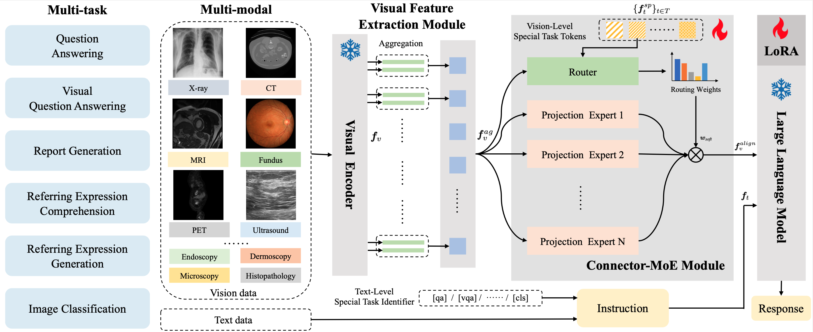

# Uni-Med

<font size='5'>**Uni-Med: A Unified Medical Generalist Foundation Model For Multi-Task Learning Via Connector-MoE**</font>

Xun Zhu, Ying Hu, Fanbin Mo, Miao Li, Ji Wu <a href='https://arxiv.org/abs/2409.17508'></a> [](https://hits.seeyoufarm.com)



【Accepted】by The Thirty-eighth Annual Conference on Neural Information Processing Systems **(Neurips 2024) [Poster]**

## Getting Started
### Preparing

**1. Environment**

Git clone our repository, creating a python environment and activate it:

```bash
conda env create -f environment.yml
conda activate uni_med
```

**Note**: If you need to perform an evaluation, please install pycocoevalcap from [here](https://github.com/sks3i/pycocoevalcap).

**2. Dataset**

To download the raw data，you can follow：
Dataset | Download path| Dataset | Download path
:---: | :---:|:---: | :---:
MedQA |  [Download](https://github.com/jind11/MedQA) | PubMedQA | [Download](https://github.com/pubmedqa/pubmedqa)
Slake |  [Download](https://www.med-vqa.com/slake)| Path-VQA  |  [Download](https://github.com/UCSD-AI4H/PathVQA)
MIMIC-CXR |  <a href="https://physionet.org/content/mimic-cxr-jpg/2.1.0">images</a> &nbsp;&nbsp;  <a href="https://huggingface.co/datasets/chaoyi-wu/RadFM_data_csv"> captions</a>| MPx |  <a href="https://huggingface.co/datasets/chaoyi-wu/MedPix-Images">images</a> &nbsp;&nbsp;  <a href="https://huggingface.co/datasets/chaoyi-wu/RadFM_data_csv"> captions</a>
SA-Med2D-20M |  [Download](https://openxlab.org.cn/datasets/GMAI/SA-Med2D-20M) | MNIST |  [Download](https://medmnist.com)

You can download the processed data (such as Slake-VQA/Slake-REC/Slake-REG; SA-Med2D-REC/SA-Med2D-REG) on [figshare](https://figshare.com/articles/dataset/Uni-Med/27265386?file=49887585), which can be directly used for training.

Set dataset path in [uni_med/configs/datasets/](./uni_med/configs/datasets/) 

**3. Pretrained Model Weights**

EVA-CLIP ViT-G [Download](https://storage.googleapis.com/sfr-vision-language-research/LAVIS/models/BLIP2/eva_vit_g.pth)

Llama 2 Chat 7B [Download](https://huggingface.co/meta-llama/Llama-2-7b-chat-hf/tree/main)


### Training

Uni-Med achieves joint training on 6 six distinct medical tasks and 12 datasets, requiring only one-stage training on a single A800 GPU and no task/dataset fine-tuning. 

(1) train config file setup

Set **resample_rate** and **resample_method** (projection/avgpool/maxpool) for visual feature aggregation.  
Set **projector_type** (linear/mlp2x_gelu/moe_linear/moe_mlp), **num_expert**, **router_method** (router_task_token/router_token/router_task), **num_task_tokens**, **task_token_c**, and **router_type** (soft/hard/constant/sparse) for connector setting.   
Set **llm_model_name** and **llm_model_path** for loading LLaMA model.   
Set **sft_type** for finetuning (lora/full/none).   
Set **lora_target_modules** and **lora_r** and **lora_alpha** for LoRA setting.  
Set **output_dir** for saving model. 

in [train_configs/uni_med.yaml](./train_configs/uni_med.yaml) 


(2) Run

```bash
CUDA_VISIBLE_DEVICES=0 torchrun --master-port 295XX --nproc-per-node 1 train.py --cfg-path train_configs/uni_med.yaml
```


### Evaluation

Set checkpoint, model parameters, save path and test set path in [eval_configs/uni_med_benchmark_evaluation.yaml](./eval_configs/uni_med_benchmark_evaluation.yaml) 

(1) Evalauting Visual Question Answering

```bash
python eval_vqa.py --cfg-path eval_configs/uni_med_benchmark_evaluation.yaml --dataset slakevqa_en
python eval_vqa.py --cfg-path eval_configs/uni_med_benchmark_evaluation.yaml --dataset path_vqa
```

(2) Evalauting Referring Expression Comprehension

```bash
python eval_ref.py --cfg-path eval_configs/uni_med_benchmark_evaluation.yaml --dataset ref_slake
python eval_ref.py --cfg-path eval_configs/uni_med_benchmark_evaluation.yaml --dataset ref_sa_med
```

(3) Evalauting Referring Expression Generation

```bash
python eval_identify.py --cfg-path eval_configs/uni_med_benchmark_evaluation.yaml --dataset invref_slake
python eval_identify.py --cfg-path eval_configs/uni_med_benchmark_evaluation.yaml --dataset invref_sa_med
```

(4) Evalauting Report Generation

```bash
python eval_identify.py --cfg-path eval_configs/uni_med_benchmark_evaluation.yaml --dataset mimic_caption
python eval_identify.py --cfg-path eval_configs/uni_med_benchmark_evaluation.yaml --dataset medpix_single
```

(5) Evalauting Image Classification

```bash
python eval_identify.py --cfg-path eval_configs/uni_med_benchmark_evaluation.yaml --dataset medmnist_2d_derma
python eval_identify.py --cfg-path eval_configs/uni_med_benchmark_evaluation.yaml --dataset medmnist_2d_organs
```


## Acknowledgement
+ [MiniGPT-4](https://github.com/Vision-CAIR/MiniGPT-4) The standard model architecture of Uni-Med follows MiniGPT-v2. Don't forget to check this great open-source work if you don't know it before!

If you're using Uni-Med in your research or applications, please cite using this BibTeX:
```bibtex


@article{zhu2024uni,
  title={Uni-Med: A Unified Medical Generalist Foundation Model For Multi-Task Learning Via Connector-MoE},
  author={Zhu, Xun and Hu, Ying and Mo, Fanbin and Li, Miao and Wu, Ji},
  journal={arXiv preprint arXiv:2409.17508},
  year={2024}
}
